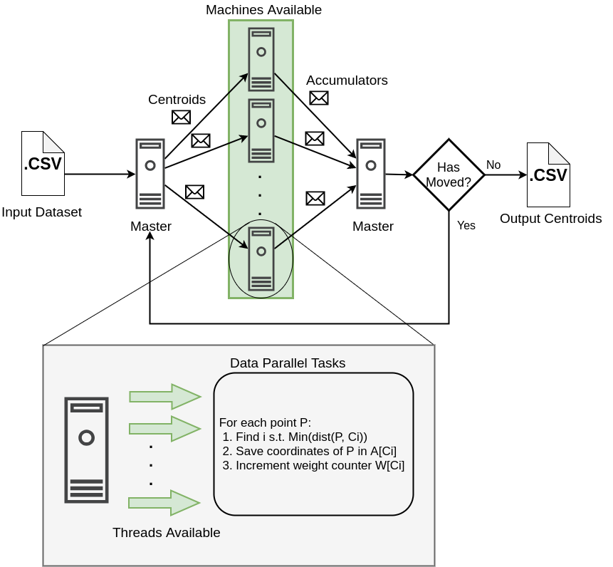

# Middleware Technologies for Distributed Systems 

## OpenMP/MPI Project

This repository provides an efficient implementation of the well known __[k-means](https://en.wikipedia.org/wiki/K-means_clustering)__ clustering algorithm, developed during the Fall 2019 Semester at Politecnico di Milano for the class of Middleware Technologies for Distributed Systems. 

## Project Design 

The chosen architecture is meant to perform better in a scenario of heavy workload. In particular, the execution flow works as follow:

1. The input dataset is split evenly among the machines available and loaded into each machine memory
2. The __master__ node takes care of initializing the array of __centroids__ (pick some random points from the dataset) and some other variables used as accumulators (centroids coordinates and centroids weight)
3. The __centroids__ are broadcasted by the master to all the machines available (included the master)
4. Each machine now can start assigning a centroid to each of the points taken from its dataset
5. This task is parallelized using the __OpenMP__ `#pragma parallel` directive 
6. Once this phase is finished the __master__ node gathers the accumulators for the centroids coordinates and weight
7. Finally, the __master__ updates the value of the centroids and check if they moved; if so, the procedure is repeated, otherwise we stop, save to a file the centroids and cleanup memory     

The picture below should help to better understand and visualize the implemented architecture. 

## Getting Started 

In order to have the project up and running on your system clone the repository and follow these instructions:

### Prerequisites and Installing

The project requires __ssh__ and __parallel-ssh__ installed and properly configured. In addition to this, in order to be able to run the script that generates the dataset __python3__,  __numpy__ and __matplotlib__ must be installed on your system. Other tools used for running some tests (like gnuplot, and openmpi) will be installed on the cluster if you execute the __init_env.sh__ script. In particular, the network configuration is supposed to have four nodes called respectively *node-0, node-1, node-2, node-3*, you can change such names in the above mentioned script passing a comma separated list of host names as input argument.

**Example:**  `./init_env.sh "node-0,node-1,node-2,node-3"` 

## Running the tests

After installation the algorithm can be tested in different ways:

- You can just run `make` and the proper executable will be compiled under the name of __kmeans__ 
- You can run the __run_experiment.sh__ script giving as input:
	- the path to the .csv file of the data-points
	- the path to the output .csv file
	- the number of centroids 
	- the number of dimensions 
	- optionally you can specify if you want to have a 2D plot of the resulting clustering    
- You can run the __run\_comparison\_experiment.sh__ script which will run a series of experiments varying the number of machines and the number of thread; optionally, the script will generate a plot of the different time duration.

**Example:**
- `./run_comparison_script.sh all` runs the experiments
- `./run_comparison_script.sh plot` only plot the results

(Both the last two commands will automatically synchronize a common directory between the cluster's machines, compile the program and run the test.) 

## Results 

Here are some plots of the results found. The experiments where executed on a cluster of 4 machines running Ubuntu 18.04.1 LTS each mounting two Intel(R) Xeon(R) Silver 4114 CPU @ 2.20GHz (20 Cores and 40 Threads in total). 
On the x-axis we have the number of threads used on each machine, while on the y-axis the have the duration of the experiment expressed in milliseconds; different lines represent different number of machines. For the plot shown below the input dataset was composed of 12 Millions of points (2 dimensions). 

As it's possible to see in the picture the execution time of an experiment drops remarkably just by adding a minimum level of parallelism. The best configuration found for the given input dataset was with 4 machines and 8 threads on each machine. Having an even bigger input dataset would probably benefit from having more threads but, if it's not the case, the synchronization overhead between the threads is a price too high to pay. A proof of this is shown in the figure below, where the size of the input dataset was reduced to 12 thousands of points (2 dimensions) 

